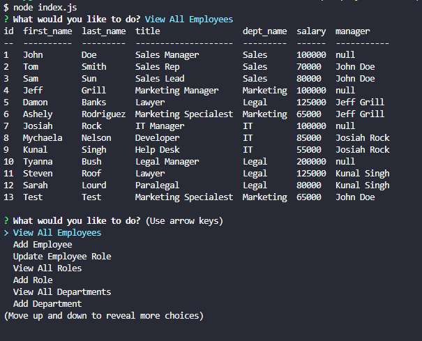

Project Title: Employee-Tracker

Project Description: This interactive application takes in the dependencies of inquirer, mysql2 and console.table. This application is for a business owner or someone in HR to have the ability to add department, roles and employees. This also gives them the ability to view all departments, roles, salary, managers and employees. Lastly this application allows the user to change and employees role. 
 
 Link: https://github.com/RPAPE3/Employee-Tracker

 Video Link: https://drive.google.com/file/d/1pkRo7A0-m5CSo2Uz_gLR5VUqVtiT4RfL/view
 

Screenshot: 
